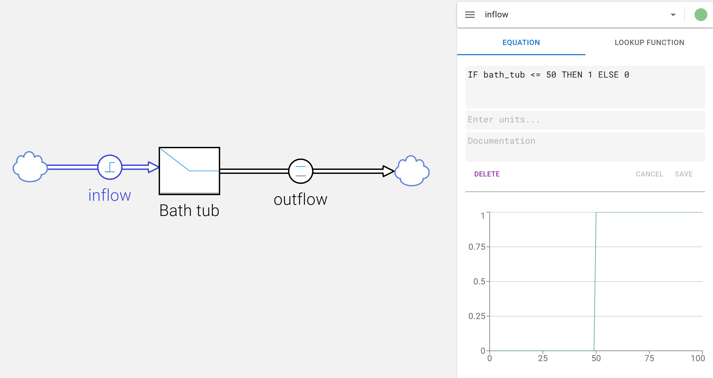

# IF THEN ELSE

Equations of stocks, flows, and variables can include conditional logic using IF THEN ELSE statements. The syntax is as follows:

```
IF <condition> THEN <value_if_true> ELSE <value_if_false>
```

Example:

Assume a model with a `bath tub` stock with an initial value of `100` and a constant outflow rate of `1` unit per time.

To model an inflow that only occurs when the water level in the bathtub is below `50`, you can use the following equation for the inflow:

```
IF bath_tub < 50 THEN 1 ELSE 0
```

