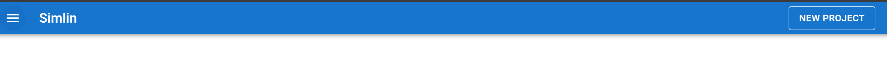
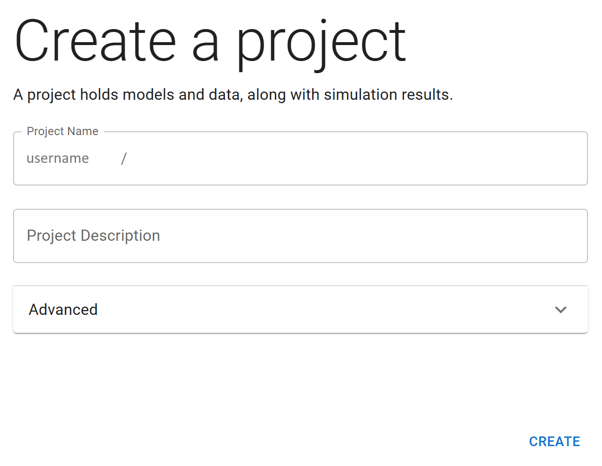
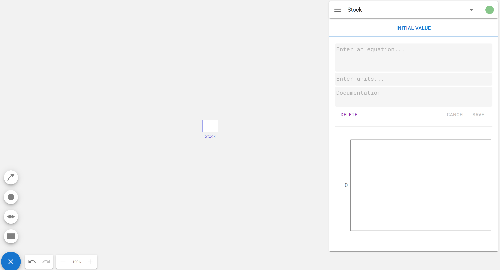
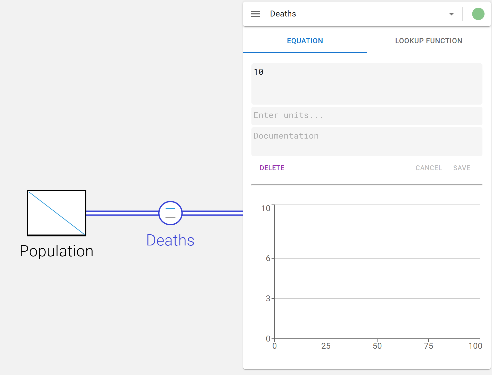
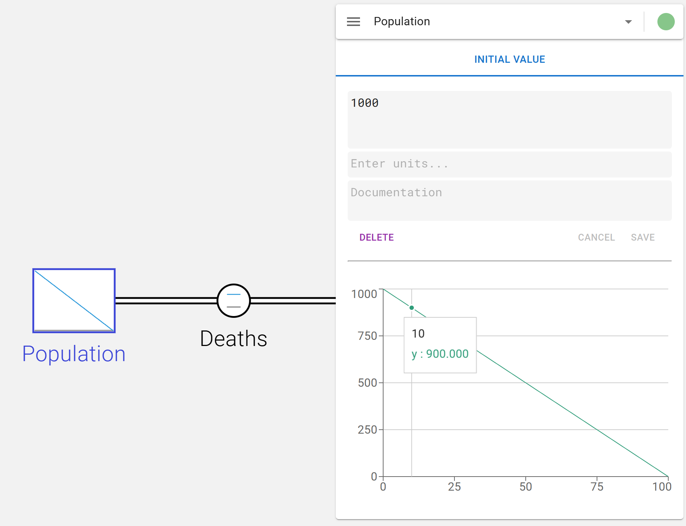
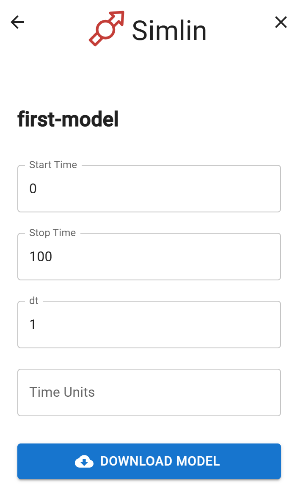
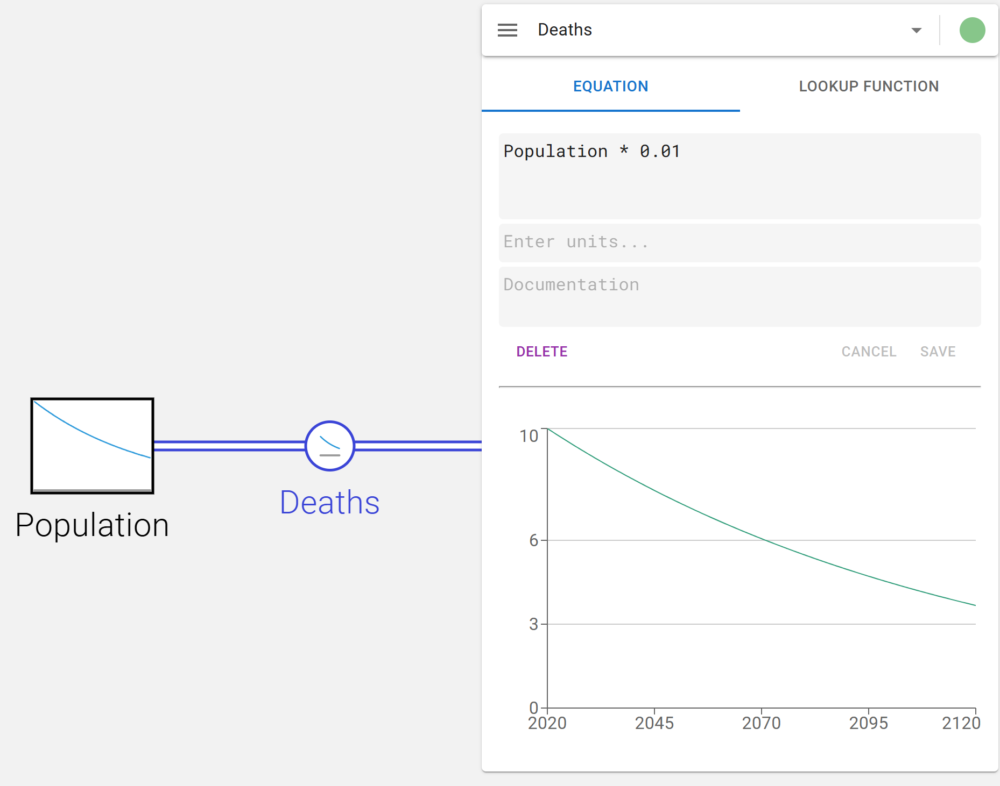
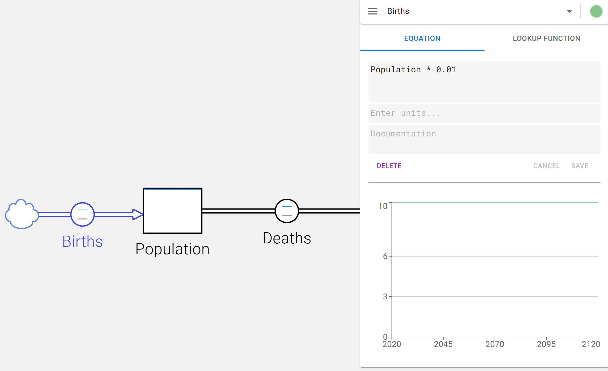
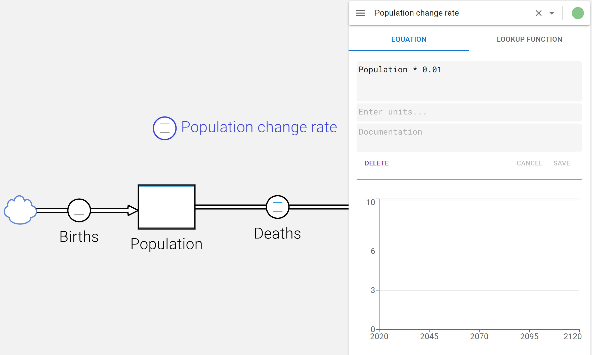
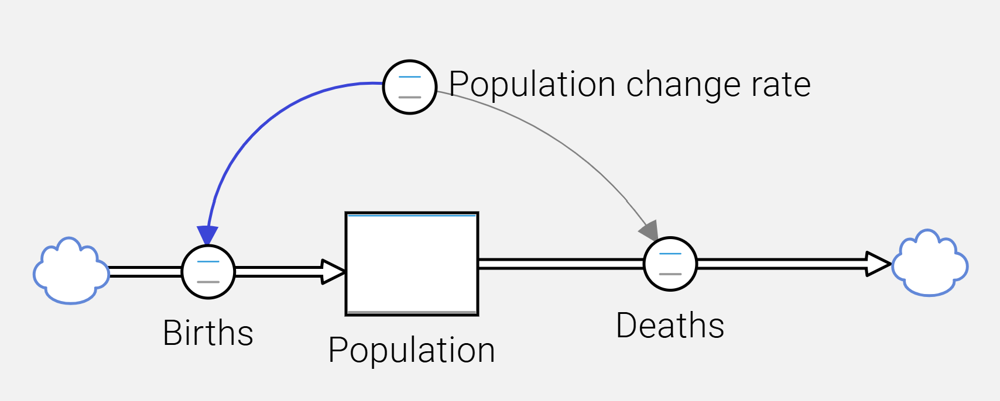

This is how you make a model.

# Create a new project

To create your first model, start by creating a new project. On the main page of the Simlin app, click on the "New Project" button in the top right corner. This will open up the "Create project" form. Give your project a name, and click "Create". This will open the model editor where you can start building your model.

# It all starts with a stock

A stock is a variable that accumulates over time. It represents the state of a system at any given moment. 

To create a new stock, click the blue edit button to view the new object creation tools. The tool for creating a stock is the first, represented by a grey rectangle. Click it, then click anywhere on the canvas to place the stock. Give the stock a name that is meaningful to your model, such as "Population" or "Inventory".

After naming the stock, select it to open its properties panel. Here, you can set the initial value of the stock, which is the starting point for your simulation. For example, if you're modeling a population, you might set the initial value to 1000.

Note that there is a little circle in the top right corner of the properties panel. This indicates whether the model has issues. If no initial value is set for the stock, it will turn yellow. Messages in red will appear to help you fix the issues. You can also click the circle to see a list of all issues in the model. If there are no issue, the circle will be green.

# Adding flows to change the stock

To change the value of a stock over time, you need to add flows. Flows are represented by arrows that connect to stocks. They can either increase (inflow) or decrease (outflow) the stock's value.

To create a flow, click the blue edit button again to view the creation tools. The flow tool is the second tool, represented by an arrow icon with a circle in the middle of the arrow. Click it, then click and drag from the stock to create an outflow. Name the flow something like "Deaths" or "Sales" depending on your model.

After naming the flow, select it to open its properties panel. Instead of the initial value for stocks, here an equation is expected. This defines the rate at which the flow changes the stock. For example, if you're modeling a population, you might set the flow rate to a constant value like 10, representing 10 deaths per time unit.

Note that after setting the flow rate, the stock will show a blue line going from the top left to the bottom right corner of the stock's rectangle. This indicates that the stock is being changed by a flow.

If you now select the stock again, the properties panel will also show the same line in the diagram. You can also hover with the mouse over a point in the diagram to see the value of the stock at that point in time.

# About the flow of time

By now, you may be wondering how time is represented in the model. To access the settings for time, click on the hamburger menu icon (i.e. an icon with three horizontal lines stacked on top of each other like this: ☰) in the top right of the app. This will open the project settings panel. Here, you can set the start and stop time for the simulation, as well as the time step (also called delta time "dt"). The time step determines how often the model is updated during the simulation.

In the example, the default settings of start time 0, stop time 100, and time step 1 are used. This means the simulation will update the model 100 times and use the calculated values to generate the diagrams of the model's elements (stocks and flows).

You are free to change these settings to values that are more appropriate for your model. For example, if you're modeling a population over a period of several years, you could set the start time to the year 2020, the stop time to 2050, and the time step to 0.5 years. The simulation would then run for 30 years, updating the model 60 times (once every half year).

# Using variables

Right now, the model is not very exciting, as it models a constant decline of the population stock. If the stock were larger (say 1,000,000), it would still decline with a rate of 10 per time unit, which is not very realistic. A more realistic model would have the flow rate depend on the current value of the stock. For example, you could define the flow rate as 1% of the current population. To do this, you can change the current flow rate equation to `Population * 0.01`.

Two things to note:
1. Instead of the fixed flow rate of 10, the flow rate is now calculated as a percentage of the population stock. The equation `Population * 0.01` uses the variable `Population` to refer to the current value of the stock. In other words, the name of a stock can be used as a variable in equations.
2. The line in the stock's properties panel is now a curve instead of a straight line. This is a result of the changed flow rate, which is high when the population stock is high, and decreases as the population stock decreases. In other words, which each time unit, less and less of the population stock is lost.

Also note that the deaths flow diagram now shows a curved line representing the different flow rates over time. Previously, no line was shown (actually, it was a straight horizontal line), because the flow rate was constant.

## Custom variables

In simple models, stocks and flows are sufficient to represent the system being modeled. However, in more complex models, you may want to add your own variables to represent additional information or calculations. While this theoretically could be done using only stocks and flows, it is often more convenient to use variables for intermediate calculations or to represent constants. This also avoids having to specify the same values multiple times in different flows.

To show this, let's add a birth flow to replenish the population stock. To ensure that the population stock neither grows nor declines, the birth flow rate should be equal to the deaths flow rate. 

First, create a new flow like before, but this time drag the arrow from outside the stock to the stock to create an inflow. Name the flow "Births". Use the same equation as for the deaths flow, i.e. `Population * 0.01`.

Note that the diagrams of the two flows and the stock change and now all show flat horizontal lines, indicating that the population stock remains constant over time.

If we wanted to change the birth and death flow rates, we now would have to change the equation in two places. This is not very convenient, especially if the equation were more complex or used in multiple flows. Instead, we can create a variable to represent the birth and death rate.

To create a variable, click the blue edit button again to view the creation tools. The variable tool is the third tool, represented by a grey circle. Click it, then click anywhere on the canvas to place the variable. Name the variable "Population change rate". Select it to open its properties panel, and set its equation to `Population * 0.01`.

You may be thinking "What good is that gonna do? Now the equation is in three places.". To change that, go back to the deaths and births flows and change their equations to `"Population change rate"`. Note the double quotes around the variable name. These are necessary because the variable name contains spaces. If the variable name did not contain spaces, the quotes would be optional.

In other words, the name of the custom variable can be used in equations just like the names of stocks.

Now if you wanted to change the flow rates of deaths and births, you only need to change the equation in the "Population change rate" variable. For example, you could change it to `Population * 0.02` to model a higher birth and death rate of 2%.

## Links to show variable use

Right now, the `Population change rate` variable is not connected visibly to the flows that use it. To make it clearer which variables are used in which flows, you can create links. Links are represented by arrows that connect variables to the elements that use them.

To create a link, click the blue edit button again to view the creation tools. The link tool is the fourth tool, represented by an arrow icon with a curved line. Click it, then click and drag from the `Population change rate` variable to the `Deaths` flow. Repeat this to create a link from the variable to the `Births` flow.

