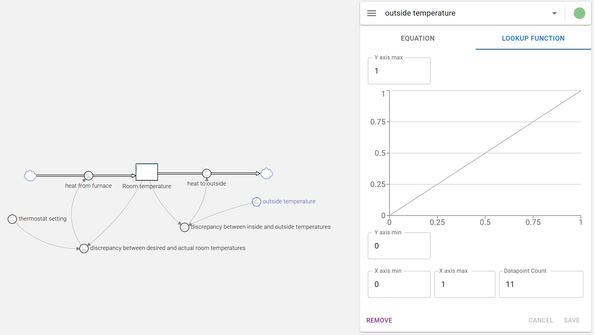
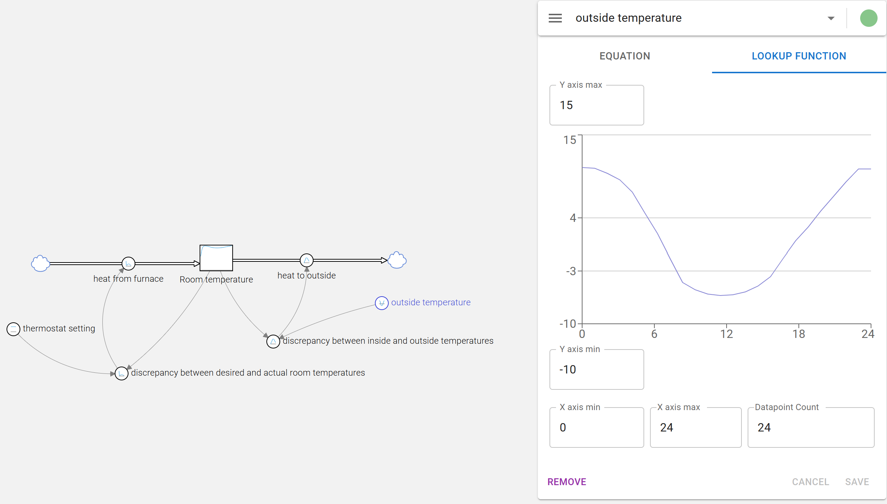
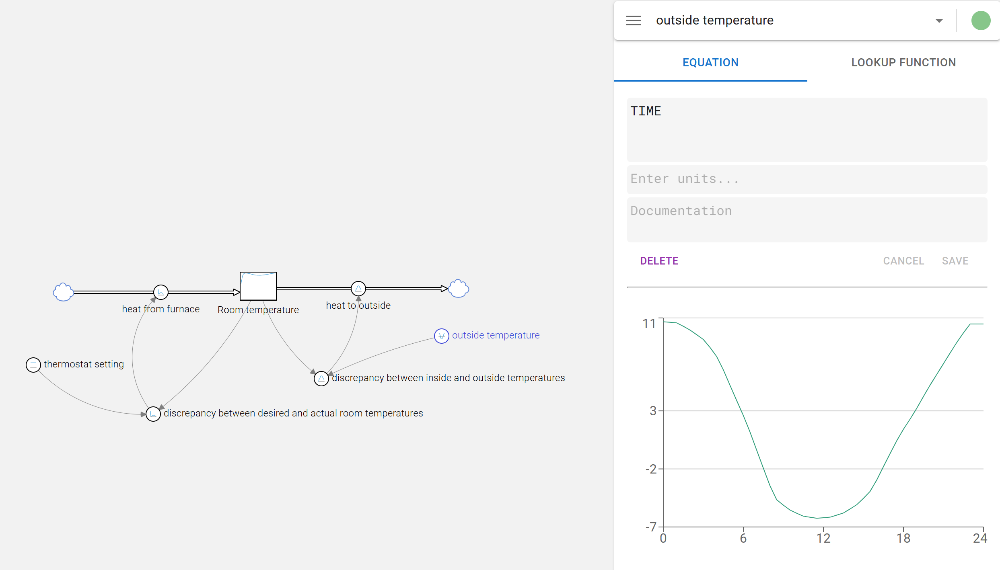

For some models, you may need a value that varies over the time of the simulation but does not depend on other variables in the model. In such cases, you can use the `LOOKUP FUNCTION` functionality to define a piecewise linear function based on specified data points.

For the following explanation, assume a model that simulates a room temperature (the stock) controlled by a thermostat. The outside temperature controls how fast the room looses heat. This outside temperature varies throughout the day.

Create a variable for the outside temperature and select it to view the properties panel. Click on the `LOOKUP FUNCTION` button to open the lookup function editor, then click on `ADD LOOKUP TABLE`. 

This brings up a diagram view with a straight line going from 0,0 to 1,1. 

You can adjust the line by clicking in the diagram to add new points. The line will be redrawn to connect the points you add. You can also click and hold and then drag the mouse to essentially draw freehand the line or curve you want.

Depending on the model, you can also adjust the minimum and maximum values for both axes. For example, in this case, you can set the X-axis to represent the time of day (0 to 24 hours) and the Y-axis to represent the outside temperature (e.g., -10 to 15 degrees Celsius).

You can also change the number of points the line or curve should consist of. This can be useful if you want to have a smoother curve or if you want to simplify the function by reducing the number of points.

Once you are satisfied with the shape of the lookup function, click on `EQUATION` to see the lookup function applied to the equation result. If the equation was a constant value, this value is interpreted as the x-value for the lookup function, and the output will be the corresponding y-value from the defined lookup function. To get the full range of the lookup function, you need an equation that varies over time, such as the simulation time. This is usually done by using the built-in variable `TIME`.

In this case, the equation will be the same as the lookup function.